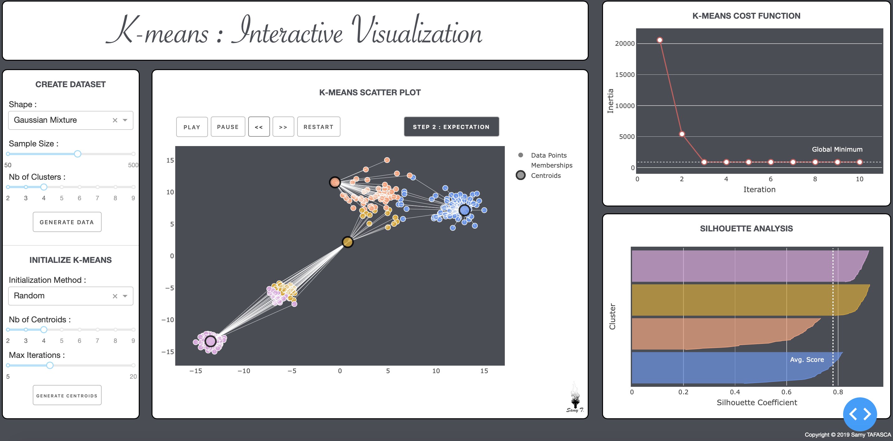

# Interactive-Kmeans

## Introduction
This is a Web Application meant for interactively visualizing the K-means clustering algorithm. The purpose is to showcase the strengths and limitations of the method under different settings (data shape, size, number of clusters, number of centroids, initialization method etc.).

## Preview
Here is a screenshot of the application :



## How to run
In order to run the application, first clone the repository, then install the required packages using the Requirements.txt. In order to do so, run the following code in your command-line (from within the application's folder) :
```
>> pip install Requirements.txt
```
Once the packages are installed, you can simply run the application by executing the `Interactive-Kmeans-app.py` script (from within the application's folder) :
```
>> python Interactive-Kmeans-app.py
```
Then, open your browser and go to the link provided in your terminal after executing the app (which is probably : http://127.0.0.1:8050/).
